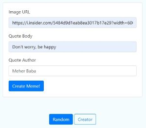

## Meme generator

This is the final project for the Udacity's Intermediate Python Nanodegree Program.

It's goal is to build a multimedia application to dynamically generate memes, 
including an image with an overlaid quote. 

#### Meme generation modes

There are two possibilities of creating a meme:
1. Random generation - A random quote (comprised of text and an author) is chosen 
from files residing in ./_data/DogQuotes (.docx, .pdf, .txt, .csv formats are supported). 
A random image is selected from files residing in ./_data/photos. Finally, an image with 
the overlaid quote is generated.
2. User selects an image and quote - User provides path/URL to the image and quote 
(comprised of text and an author). Then, an image with the overlaid quote is generated.

#### Interfaces

##### Command-line interface

The application can be executed from the command line with `python meme.py`. This command takes
three optional arguments:
- a string quote body `--body`
- a string quote author `--author`
- an image path `--path`

As a result, the path to the generated meme is printed. 

###### Two examples of command-line interface usage:

`python meme.py` (picking a random image and quote)

`python meme.py --path "./_data/photos/dog/xander_1.jpg" --body "Don't worry, be happy" --author "Meher Baba."`

##### Web interface

By executing `python app.py` a flask server is run locally. The GUI also allows to generate memes in 
two modes.  

The same results as above (in command-line interface) can be created by clicking "Random":

Or by clicking "Creator". Then, a form can be filled with Image URL, Quote Body and Quote Author. After filling the 
form, "Create Meme!" should be clicked to generate a meme.

#### Project setup

To setup the project just run:

`pip install requirements.txt`